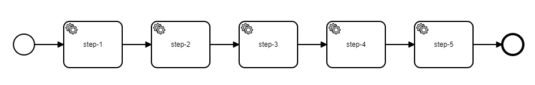
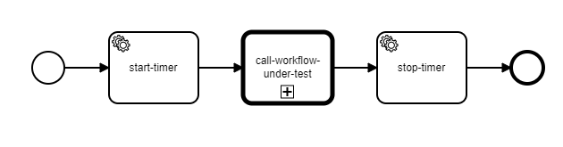
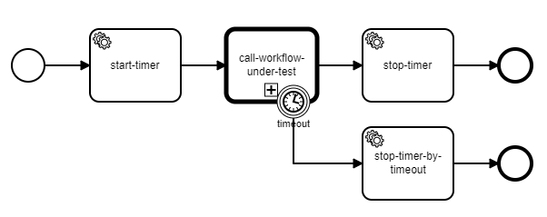

[](https://github.com/Camunda-Community-Hub/community/blob/main/extension-lifecycle.md#incubating-)
[](https://github.com/camunda-community-hub/community)


## Zeebe Process Generator

This project provides a tool to automatically generate processes for [Zeebe](https://zeebe.io/).

These processes can be used in automated tests and performance benchmarks.

### Usage

The prcoess generators can either be used as a Java dependency, or they can be invoked from the
command line.

### General CLI Usage

```
Usage: [-hV] [-i=<processId>] [-o=<outputFile>] COMMAND
Creates processes
  -h, --help      Show this help message and exit.
  -i, --processID=<processId>
                  ID for the process to be generated, defaults to "process"
  -o, --output=<outputFile>
                  File to write the process to, defaults to "process.bpmn"
  -V, --version   Print version information and exit.
Commands:
  sequence  Generates a sequential process with a given number of steps.
```

#### Sequence Process

This will produce a sequential process with a given number of steps and a given jobtype.



```
  -j, --jobType=<jobType>   Job type for steps in process, defaults to "job"
  -s, --steps=<steps>       Number of steps in process, defaults to "5"
```

#### End-to-End Timing Process

This will produce a process like this:



The created process starts a timer, then calls the process that should be timed, and stops the timer
at the end.

Optionally, you can also define a timeout. When the timeout is reached the process that should be
timed will be aborted.



```
  -t, --timeout=<timeout>   Timeout after which process execution should be
                              aborted
      -wut, --process-under-test-id=<processUnderTestId>
                            (Mandatory) ID of the workfow that should be
                              measured
```

### Outlook

* Generate process that calls another process n times
* Generate process that calls another process again and again until a certain time has passed
* Generate a number of processes: a *sequence* process, called by a *timing* process, called by a *
  repeat n times* process, called by another *timing* process. The net result would be a bunch of
  process descriptions with one big start event. Once started, the innermost process will be
  executed n times. Each execution is timed, and the aggregate of all executions is timed. This is -
  in essence - a very simple benchmark setup
